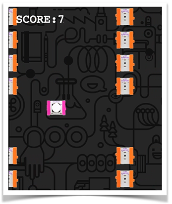
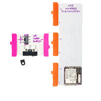
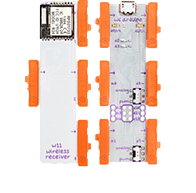
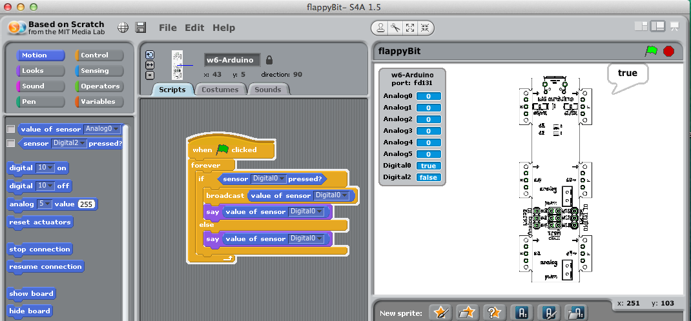

## Overview

flappyBit is a simple Flappy Birds game controlled with littleBits using an input trigger and the arduino module.

A [Scratch](http://www.scratch.edu) sketch connects the inputs from the littleBits with a node.js application that converts the triggers recevied from the Arduino into events that the game running in the browser

It was put together for  talks and demos of littleBits that i've been doing - but it may be useful for others who are wanting to connect up their littleBits collection to other things. 

## Technical Overview

The basic flow is:

- When a input bit is pressed, the trigger will be sent to the Ardiono.
- The sketch running in Scratch will receive the input and broadcast it over its remote sensor connection.
- The node.js app will receive the input and send a message to any websocket connections (flappyBit game in browser), to make the bit jump.

It is comprised of the following:

- [littleBits Arduino module](http://littlebits.cc/kits/arduino-coding-kit). In this setup the [wireless transceiver/receiver](http://littlebits.cc/boost-its/wireless) will be used to seperate the controller from the Arduino but basically it needs to have a trigger from an input bit connected to the Arduino.
- [Scratch](http://www.scratch.edu) communicating with the littleBits Arduino module. 
- A Flappy Birds clone built using [Phaser](http://www.phaserjs.com) and based on LessMilk's [excellent tutorial](http://blog.lessmilk.com/how-to-make-flappy-bird-in-html5-1/) running in the browser that received input from the littleBits to make. It is packaged as a Node.js application in order to communicate to Scratch over a regular socket connection and the browser with websockets.

##Setup

Download and extract the project files from the Github [repository](https://github.com/mintsource/flappyBit/archive/master.zip): 

### littleBits

- Attach an input bit such as a button or a roller to you the Arduino's d0 connector. This could simply be connected directly or a more elaborate setup - providing a wireless controller on a mounting board as shown below.
- Connect up the Arduino to a USB port and power on your computer. 

 

### Scratch

littleBits recently released an extension for the Scratch for Arduino environment which makes it very simple to connect the littleBits Arduino to Scratch.  

- [Download](https://github.com/littlebits/lbScratch/blob/master/Scratch-14/binaries/LB_S4A.dmg.zip) and install the littleBits Arduino version of S4A. Intstall the custom firmware onto your littleBits Arduino module by following the instructions [here](http://GettingStartedwithlittleBitsScratch1.4.pdf)
- Connect the littleBits Arduino module with a input, such as a button to the d0 connector as shown below.

- Open the scratch project, ./scratch/flappyBit.sb from within the flappyBit project.

On the right you can see the image of the littleBits Arduino. If you board is connected 

- In the right hand preview window, the "Searching board..." message should disappear once it has successfully found the board.
- Click the littleBits input button that is connected to d0 and check the value in the Digital0 reading changes from false to true when the button is pressed.

- Right click on the `If` block and `enable remote sensor connections`. This mean Scratch will send out `broadcast` activities to anything listening on a TCP/IP socket, by default running on port 14000.

### Game setup

####Pre-requisites

- Install node.js if it isn't already, the application has been tested with the v.0.10.x versions. it may work with older versions but hasn't been tested. 

#### Getting it running

- Once installed, go to the extracted project directory and run `npm update`
- Once completed type `node server`
- If things are successful then the game should be accessible at http://localhost:8989
- Try pressing the littleBits input and if things are successful you should see the the flappyBit in the game jumps.

#### Troubleshooting

- The game will also respond to the space bar, check whether that is working. 
- If this works but you have no response from the littleBits, check that the communication to Sketch is working and the bubble containing "true" appears when you click it.
- Make sure you have enabled "remote sensor connections" in the Scratch sketch.

If you are still unable to get it working, leave a comment on the github [repository](http://www.github.com/mintsource/flappyBit).

